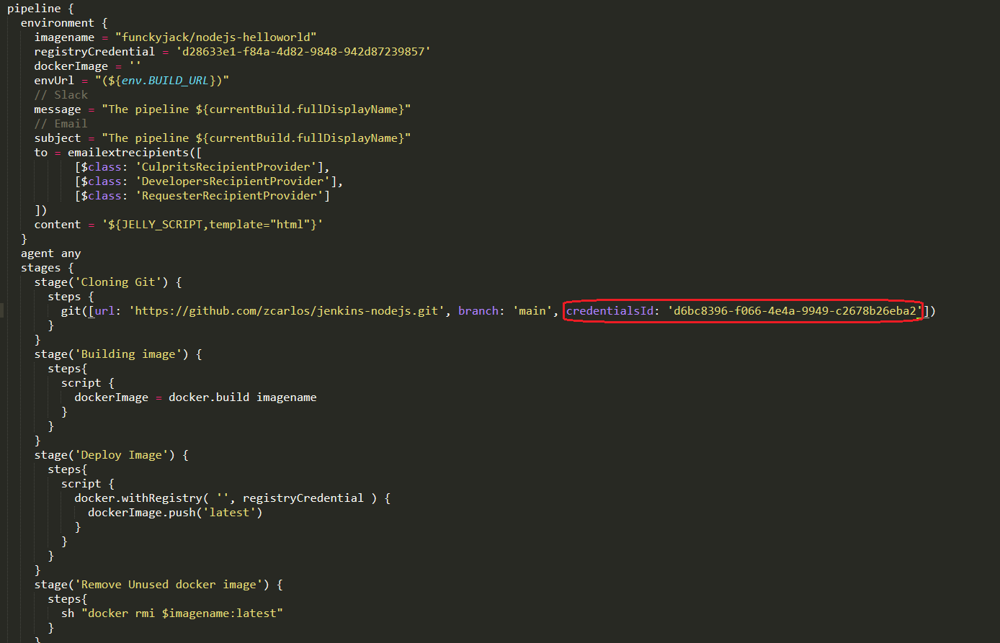

# Jenkins

- Jenkins Declarative Pipeline syntax is used in this project.

### Declarative pipeline syntax, is a more recent feature:
- richer syntactical feature over Scripted Pipeline Syntax
- is designed to make writing and reading Pipeline code easier

Check complete documentation:
https://www.jenkins.io/doc/book/pipeline/

### Configuring jenkins pipeline path to access a JenkinsFile on a github subfolder

- Project pipeline, go to Configure. Select Pipeline tab, as shown in the image below:

- Configure JenkinsFile github id, as shown in the image below:

